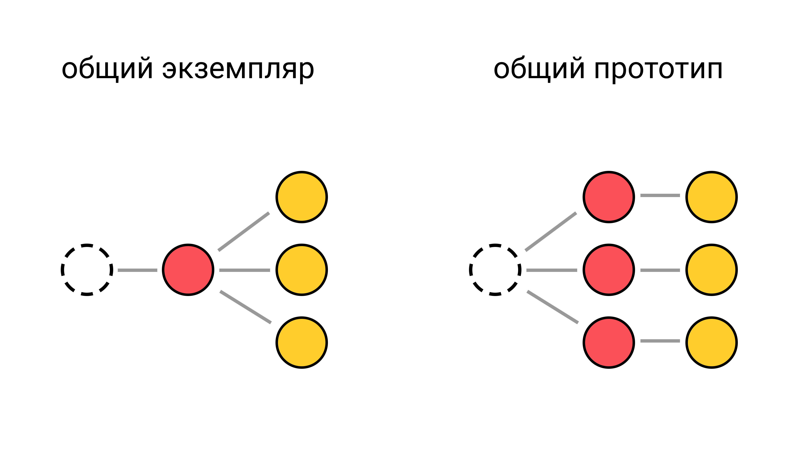

---

layout: yandex2

style: |
    /* собственные стили можно писать здесь!! */


---

# {:.logo}

## {{ site.presentation.title }}
{:.title}

### {{ site.presentation.service }}



{:.nda}


<div class="authors">

<p>{{ site.author.name }}, {{ site.author.position }}</p>



<p>{{ site.author2.name }}, {{ site.author2.position }}</p>


</div>

## Содержание тестов важнее инструментов
{:.shout}

## Это сложно!

- {:.next}не заинтересованы
- {:.next}приложение не готово

## Как проверяли задание?

Добавляли в код ошибки, запускали тесты, смотрели, сколько ошибок они нашли.

- не происходят ожидаемые действия в интерфейсе
- неправильные данные в интерфейсе
- не изменяется состояние
- ошибки на сервере
- сломалась вёрстка
  - отдельно смотрели на мобильных
  
## Проблемы  
  
- не все важные сценарии покрыты тестами
- проверяется не тот результат
- проверяется только ошибочный сценарий

## Тесты скриншотами

- просто писать
- {:.next}очень общие
- {:.next}хрупкие

&nbsp;

<div class="next" markdown="1">
Как уменьшить хрупкость:

- делать скриншоты отдельных блоков
- закрашивать часть элементов
</div>

&nbsp;

{:.next}не забыть сохранить начальные скриншоты

## Все написали интеграционные тесты
{:.shout}

## Проблемы интеграционных тестов
{:.section}

## Первая причина:<br/>изменения верстки

- вынести селекторы в константы
- паттерн page object
- селекторы могут быть хрупкими
- использовать тестовые css классы.

## Вторая причина:<br/>нестабильная инфраструктура

- отказывает selenium грид
- отказывает тестовй стенд

**Помогут ретраи, улучшение инфрраструктуры, изоляция зависимостей**

## Третья причина:<br/>сложные ситуации

 - {:.next}отправка данных меняет общее состояние
 - {:.next}сложно застабать БД и сторонний бэкенд
 - {:.next}недоступность элементов: виртуальный скролл, перекрытие другими элементами, disabled, 
 - {:.next}асинхронные действия - нужно ждать элементы
 - {:.next}ошибки в тестах, например, забыли await

## Алгоритм

**Всё, что возможно проверить модульными тестами.<br/> Остальное — интеграционными.**

&nbsp;

  - {:.next}разбили приложение на смысловые блоки
  - {:.next}смотрим интерфейс, находим сценарии
  - {:.next}если логика сценария находится внутри блока, пишем модульный тест
  - {:.next}если важно взаимодействие блоков или в блоке мало логики, пишем интеграционный тест

## Модульные тесты:<br />внешние зависимости
{:.section}

## Проблемы

1. зависимости не изолированы
2. общие экземпляры заглушки

## Схема прототипы и экземпляры
{:.fullscreen}



## Рефакторинг!
{:.shout}

## опциональные параметры
{:.fullscreen}

```js
// git.js
function gitHistory(git = executeGit) {
    return git().then(/* ... */);
}

// git.test.js
it ('из вывода git парсятся поля hash, timestamp, author, msg', () => {
    const gitStub = () => Promise.resolve('...');

    const result = gitHistory(gitStub);
    // ...
});
```

## переписать на классы
{:.fullscreen}

```js
// git.js
class GitHelpers {
    constructor(gitStub) {
        this.git = gitStub || executeGit;
    }
    gitHistory() {
        return this.git().then(/* ... */);
    }
}
// git.test.js
it ('из вывода git парсятся поля hash, timestamp, author, msg', () => {
    const gitStub = () => Promise.resolve('...');
    // разные экземпляры в каждом тесте
    const result = new GitHelpers(gitStub).gitHistory();
    // ...
});
```

## контроллер express
{:.fullscreen}

```js
function(req, res, next) {
    getHistory()
        .then(data => {
            res.render({ 
                data,
                // ... 
            });
        },
        err => next(err));
}
```

## фабрика
{:.fullscreen}

```js
// indexController.js
function createController(historyStub) {
    const getHistoryFn = historyStub || getHistory;

    return function(req, res, next) {
        return getHistoryFn().then(/* ... */);
    };
}
// indexController.test.js
it ('...', () => {
    const historyStub = () => Promise.resolve({ /* ... */});
    const indexController = createController(historyStub);

    indexController(...);
    // ...
});
```

## Код, нужный<br />только в тестах - ОК.<br /><br />Уродливый код - НЕ ОК!
{:.blockquote}

## Модульные тесты:<br />хорошие практики
{:.section}

## Top 3 нарушений

- {:.next}бесполезные проверки
  - например, проверяется формат, но не проверяются данные
- {:.next}файловая структура не соответствует структуре тестов
  - например, всё в одном файле
- {:.next}непонятные названия 
  - очень общие, например *"This repo - second commit"*
  - сформулированы в терминах реализации, например: *если передать 5, то вернет пустой массив*

## Нет описания 🙁
{:.shout}

## Интеграционные тесты
{:.section}

## Сложность в инструментах

- Гермиона не устанавливалась
- нужно настроить запуск приложения
- тесты скриншоотами не работали
- как подключить плагин из локальной папки?

## Интеграционные тесты — это просто?
{:.shout}


## Интеграционные тесты — <br/>тоже сложно
{:.shout}

## Итоги

- {:.next}задали себе правильные вопросы
- {:.next}попробовали инструменты

&nbsp;

- {:.next}итог для меня — выбрать другое приложение

## Контакты 
{:.contacts}



<figure markdown="1">

### {{ site.author.name }}


{{ site.author.position }}


</figure>





<figure markdown="1">

### {{ site.author2.name }}


{{ site.author2.position }}


</figure>



<!-- разделитель контактов -->
-------

<!-- left -->
- {:.mail}dima117a@yandex-team.ru
- {:.github}dima117

<!-- right -->
- {:.skype}dima117a
- {:.telegram}dima117a

<!-- 

- {:.mail}author@yandex-team.ru
- {:.phone}+7-999-888-7766
- {:.github}author
- {:.bitbucket}author
- {:.twitter}@author
- {:.telegram}author
- {:.skype}author
- {:.instagram}author
- {:.facebook}author
- {:.vk}@author
- {:.ok}@author

-->

